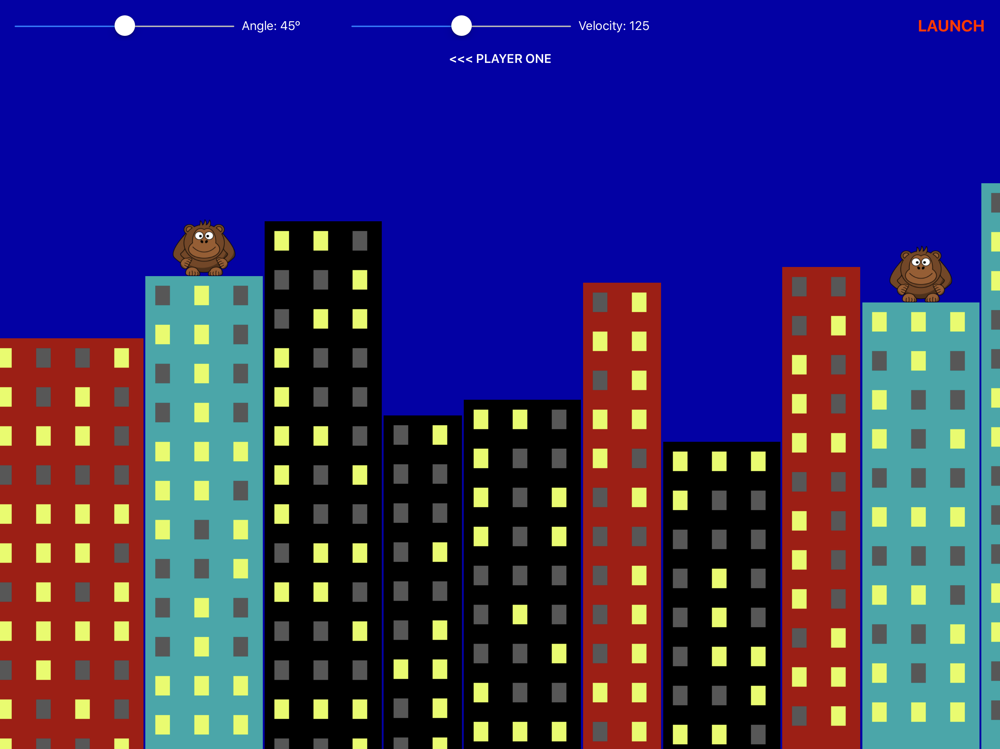
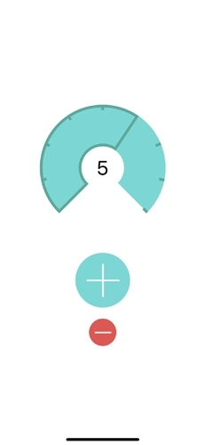

# Swift-Tutorials
All kinds of projects to improve my knowledge, click on the screenshot to go directly to the source code for the specific project.

## Exploding Monkeys
_[Gorillas look a like game](https://en.wikipedia.org/wiki/Gorillas_(video_game))_

## Core Graphics

## Flo Water Counter

## Pachinko

## Names to Faces

## Swifty Words

